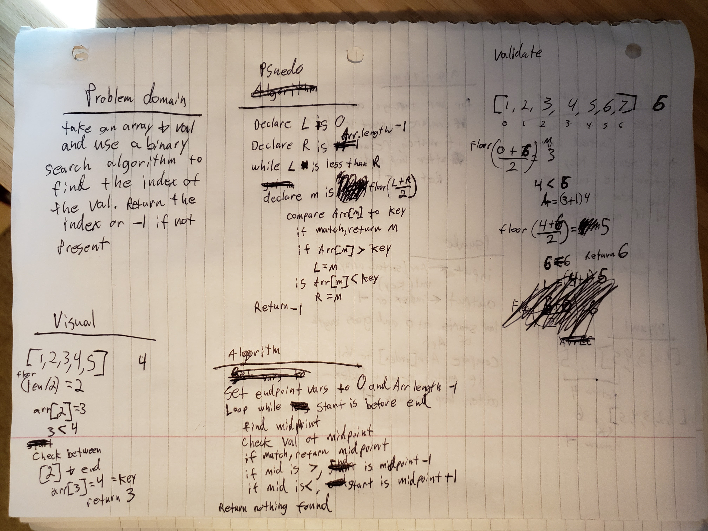

# Challenge Summary

Create a function that takes in 2 parameters (sorted array and search key) and returns the index of the element that matches the search key OR -1 if not present using a binary search algorithm.

## Challenge Description

1. create function `binarySearch` that takes two parameters
2. first parameter is a sorted array, second parameter is a search key
3. find the midpoint of the array and compare value to key
4. if the midpoint is greater than key, set the upper bound to the midpoint
5. if the midpoint is lower than the key, set the lower bound to midpoint
6. if the midpoint matches the key, return the midpoint
7. if the lower bound is ever above the upper bound, end loop and return -1 for `not found`

## Approach & Efficiency

- binary search is extremely efficient, regardless of the array size.
- even with over 1 million items the search time is nearly equivalent to an array of only 1000 records

## Solution

