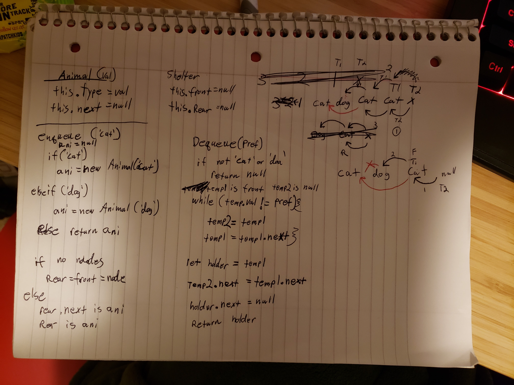

# Challenge Summary

make a queue `Shelter` that adds an `animal` class of either `dog` or `cat`

## Challenge Description

- `enqueue(val)` should create a new animal object, of either `dog` or `cat` only
  - it should add that object to the queue
- `dequeue(pref)` will return the first `animal` that matches the `pref`, otherwise it will return `node`
  - this will excise that `animal` and leave the rest of the queue in place

## Approach & Efficiency

- O(2n) of the list as it doesn't copy, it just crawls the list looking for a matching value. There is a cleanup at the end to ensure the rear is set correctly afterwards.
- some special handling of `front` or `rear` instance and other error handling
- `temp` values are created, one space apart on the queue
  - if the leading `temp` finds the value, the trailing `temp`.next jumps forward
  - front/rear special handling involved

## Solution

