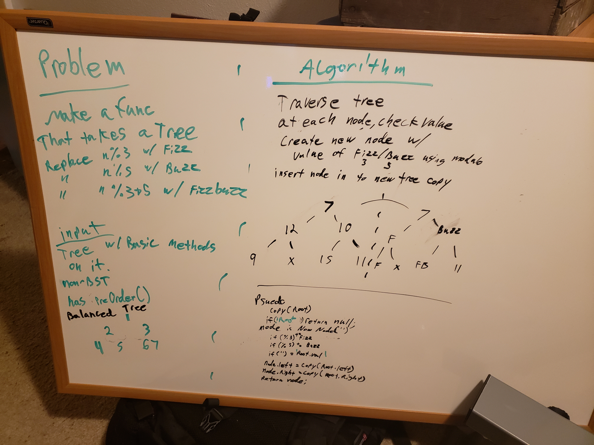

# Challenge Summary

## Challenge Description
- write a function to take in a tree
- checks each node if divisible by 3/5/both
- creates a duplicate tree with swapped values
  - fizz = divisible by 3
  - buzz = divisible by 5
  - fizzbuzz = divisible by both

## Approach & Efficiency

- function will check if the current root is null and end
- if the node != null, create node('') and run value checks
  - root.val %3 == 0? node += 'Fizz'
  - root.val %5 == 0? node += 'Buzz'
  - node.val == ''? node = string(root.val)
- node left is set to root left
- node right is set to root right
- node is returned

- this recursivly duplicates the tree but makes sure that the resulting tree (which is not a tree object, just a node tree) has had each value compared first

- I brought in the BST from previous challenge just to make the creation of testing data a bit easier

- size and speed are the same as creating a new tree, each node needs to be crawled, compared, and copied, though the copy does NOT require the same traversal. O(n) for size and O(2n) for size due to copy

## Solution

