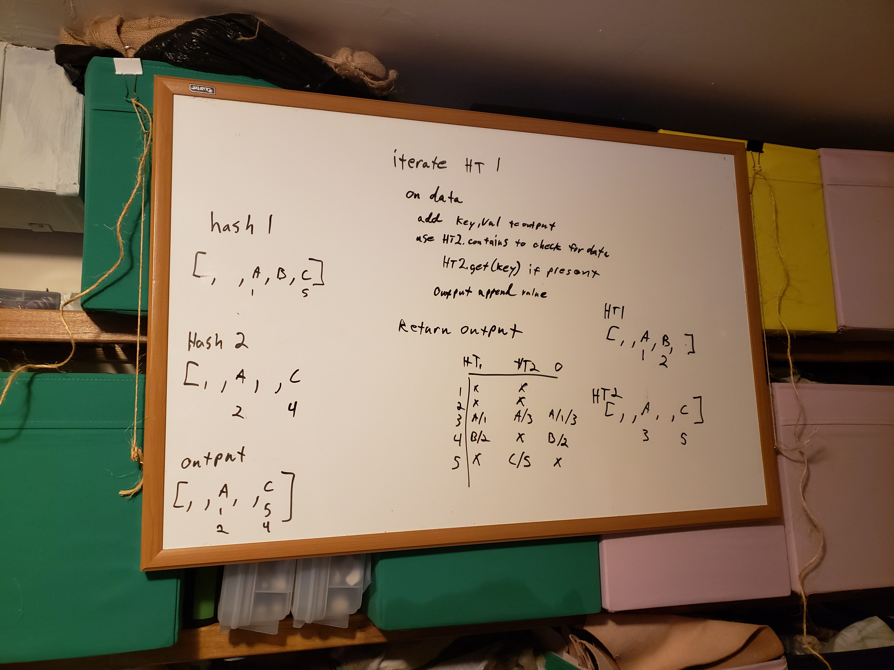

# Left Join

## Challenge

- create a left join of two hashmaps
- param1 is hashmap of `word:synonym`
- param2 is hashmap of `word:antonym`
- make a new datastructure
  - all of param1 is added
  - any match in param2 is appended to param 1 values
- avoid library methods

### assumptions

1. hashtables use the same format as the ones we used previously (key,val pairs)
1. we have access to get/set features of a hashtable and the included LL tools
1. an array is a valid output

## Approach

- Speed: O(n+n) (?) I'm not sure how to word it but you have to traverse the left table, and then compare against right list. this takes additional time but isn't a complete traversal
- size: O(2n) at least 1 full copy of the data is created for the left table and then appended to from the right table

## Solution

