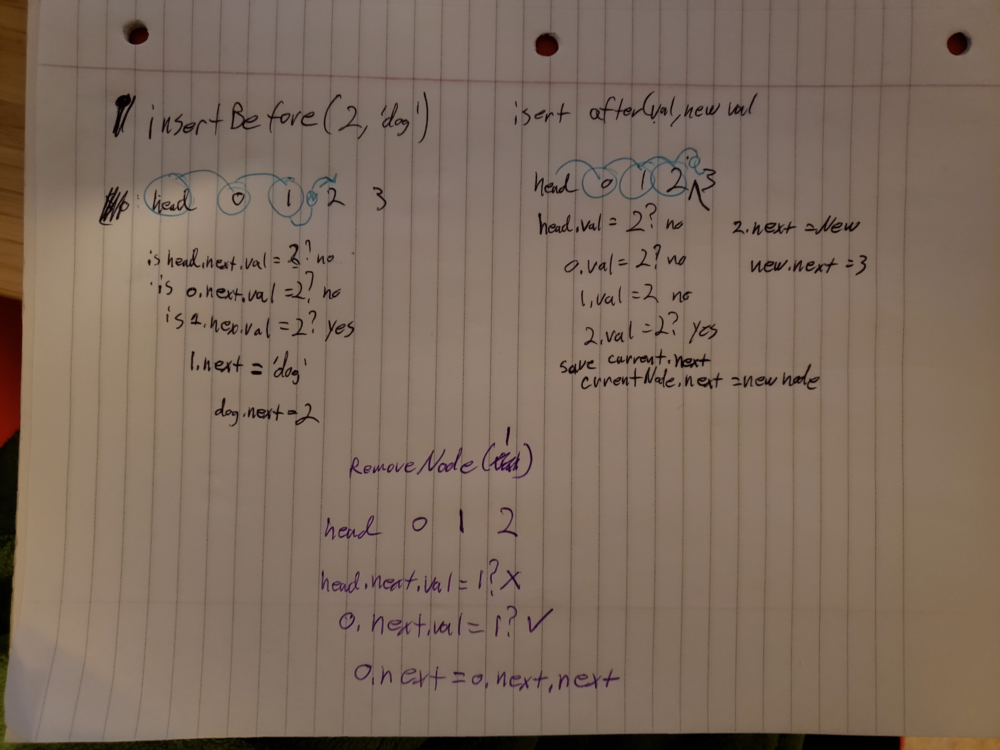
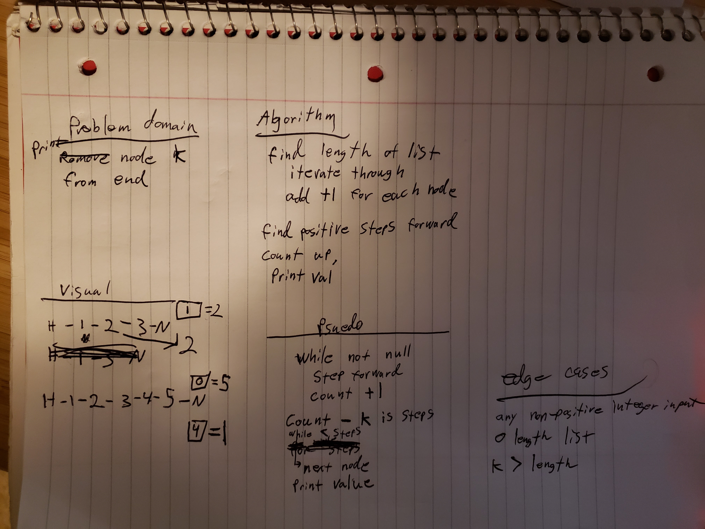

# Challenge Summary

- make a singly LinkList
- have an `insert` that puts a new node as the head
- make `includes` which traverses the list and returns a bool if the val is found
- make `toString` which converts all the node values in to a single string to print
  - `"{ a } -> { b } -> { c } -> NULL"`
- capture errors

## Challenge Description

- make the following tests
  [x] Can successfully instantiate an empty linked list 
  [x] Can properly insert into the linked list 
  [x] The head property will properly point to the first node in the linked list
  [x] Can properly insert multiple nodes into the linked list
  [x] Will return true when finding a value within the linked list that exists
  [x] Will return false when searching for a value in the linked list that does not exist
  [x] Can properly return a collection of all the values that exist in the linked list

## Approach & Efficiency

- all approaches traverse the array in `singly` direction wtih O(n) efficiency
- there are some unique states for empty list that return but will be expected for the method called
- I opted to NOT employ errors but rather handle the states in a manor that is logical for the instance (such as empty list for `toString()` and `includes(val)`

## Methods

- `insert(val)` will insert a new node at head and append the rest of the list
- `includes(val)` will return false if no head, traverse list and return true if val is found, false if next node is NULL
- `toString()` returns a string of the array values formatted as indicated
- `append(val)` will add a new node at the end of the list
- `insertBefore(val, newVal)` will add a new node before the indicated val
- `insertAfter(val, newVal)` will add a new node after the indicated val
- `removeNode(val)` will remove a node with the indicated val
- `kthFromEnd(k)` will print the value at the midpoint of the list, rounded down
- `midwayPoint()` will print the value in the middle of the linked list

[PR](https://github.com/Ginsusamurai/data-structures-and-algorithms/pull/26)

