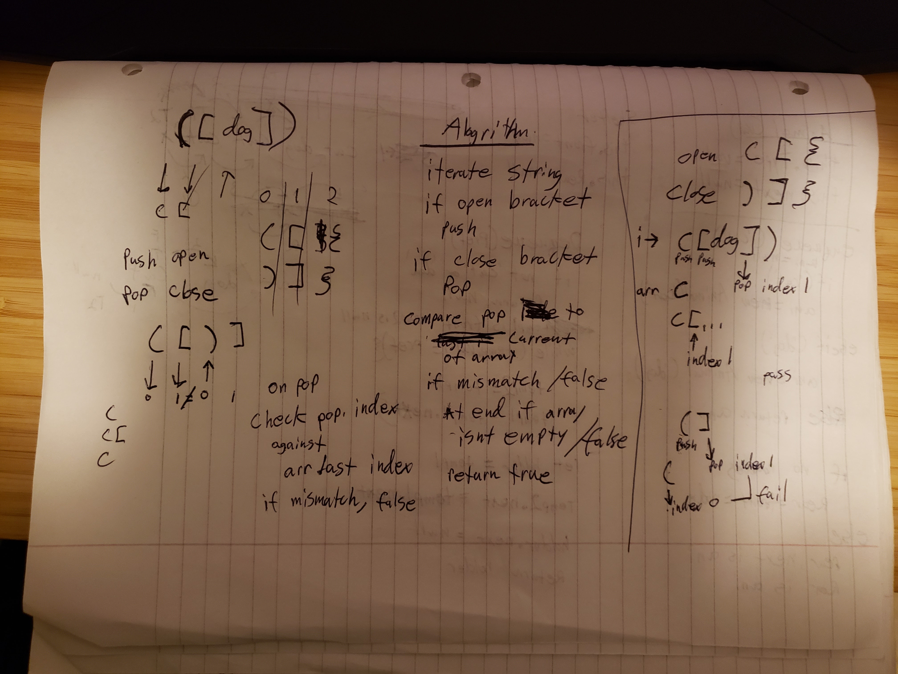

# Challenge Summary

- write a function that takes in a string as in input and return true if the brackets in the string are balanced (i.e. for each open bracket there is a matching closing bracket in sequence) or false if not

## Challenge Description

- the function needs to account for any length of string and also any characters that may be inbetween the brackets as well as having dangling brackets at the end

## Approach & Efficiency

- make arrays for `openBracket` and `closeBracket` populated accordingly
- for each opening bracket, push to a holding array
- for each closing bracket, pop from the holding array
- for each pop, compare the index of the current array index (for example [ ) to the popped value ( ] )index in the close brackets array
- if the indices do not match, return false
- if they match, continue the loop
- after the loop is compelte, if the holding array is not empty, return false
- at the end, return true

## Solution

