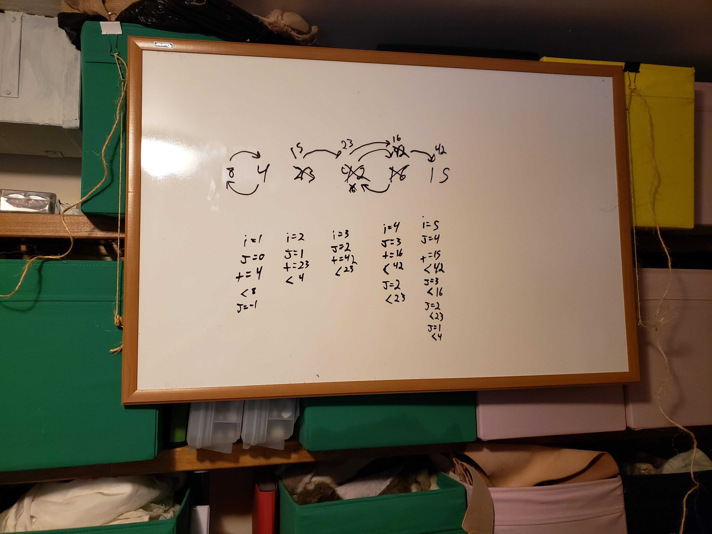
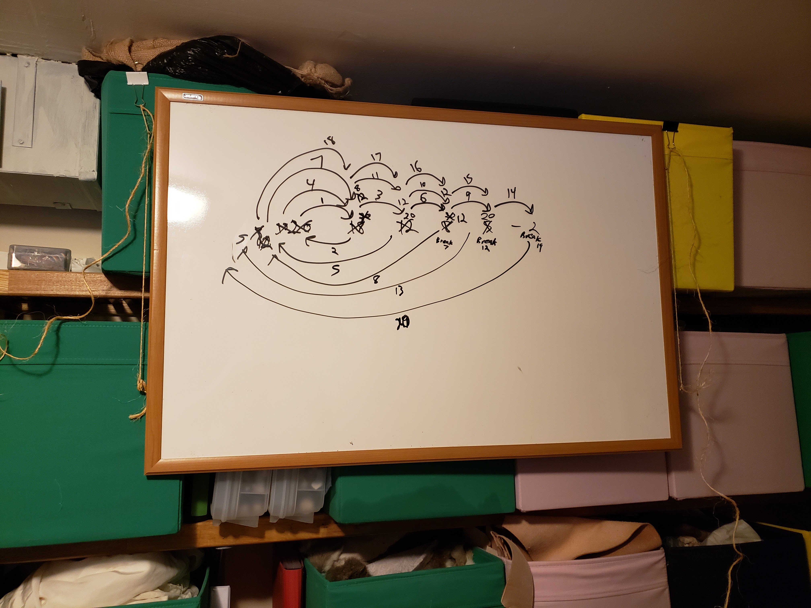
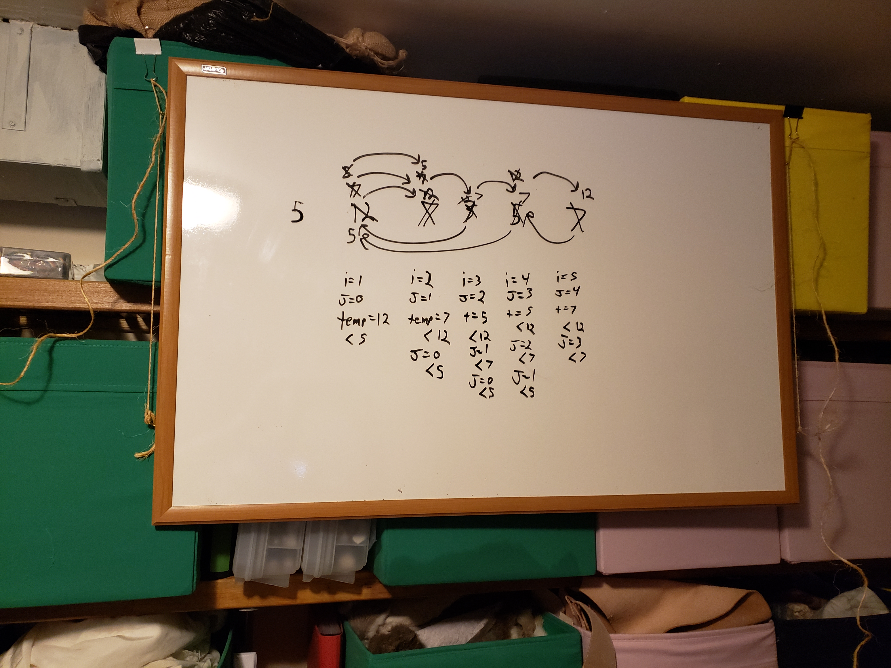
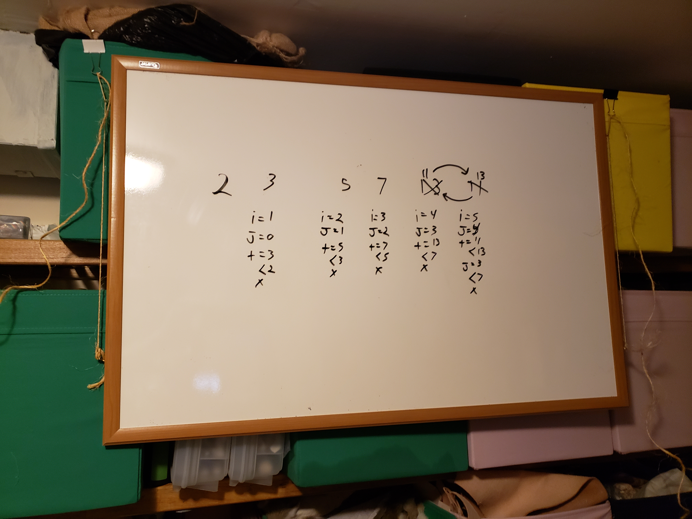

# insertion sort

```javascript
Pseudocode
  
  InsertionSort(int[] arr)
  
    FOR i = 1 to arr.length

      int j <-- i - 1
      int temp <-- arr[i]

      WHILE j >= 0 AND temp < arr[j]
        arr[j + 1] <-- arr[j]
        j <-- j - 1

      arr[j + 1] <-- temp
```

walkthrough:

1. function takes in an array of integers
2. iterates through the length
3. `j` set to `i` - 1 (current index - 1)
4. `temp` is current value of array
5. while j is above 0 and `temp` is less than value of `j` (index -1)
  1. array at `j` + 1 set to array `j`
  1. `j` set to `j` -1
6. array at `j` + 1 set to `temp`

### walkthrough Examples






