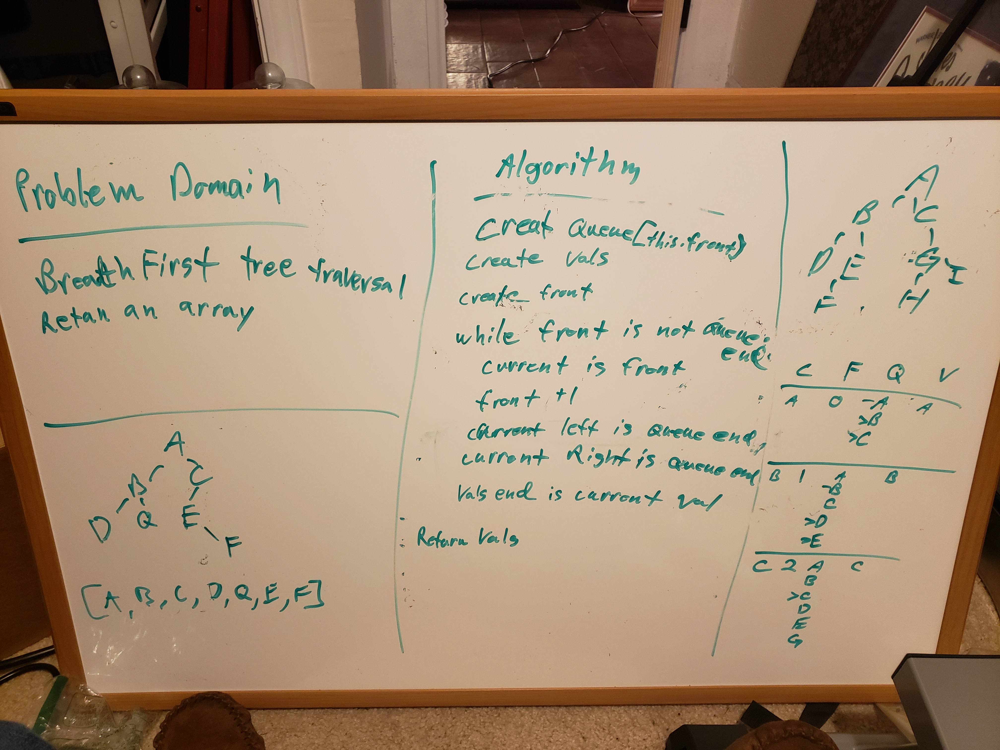

# Trees

- trees are a data structure that is an extension of the concept of a linked list. A tree starts at a `root` and expands out in 2 or more nodes, continually, until eventually terminating in a `leaf` node that has no further children.
- traversal if often done via recursion to simplify the code and allow easier handling

## Challenge

- create a binary search tree that can create, add, and traverse nodes 
- adhere tot the concentions of `left is lower` and `right is higher`
- use recursion as possible for optimal design

- create a `breadthFirst` method to traverse a tree and return the the values in order of level, from left to right

## Approach & Efficiency

- recursive functions are the cleanest way to to do this. i had to look at some examples before I started to figure out how they work exactly, with creating a massive stack and then peeling it back apart as each instance on the stack resolves.
- this creats some more overhead in terms of memory I think, as each instance of the function takes up space, but it allows a cleaner traversal and less complicated lines of code (once you understand what it's doing)

- `breadthFirst` can't use methods so we need to create a `queue` with only basic data manipulation
  - create an array to hold values and another array to act as the node queue, make a `front` pointer to hold the current position of the queue
  - `while` loop to continue as long as `front` does not equal the length of the queue array
  - current node is the queue array at index `front`
  - increment `front`
  - add left/right nodes to end of node queue
  - add value of current to end of value array
- time O(n) as it has to traverse the entire array once.
- space O(2n) as you need a copy of each node stores in memory to work on in the queue.

## API

- `add(value)` add a new node
- `contains(value)` confirms a value is present in tree
- `preOrder()` can return an array of the tree in pre-order (root, left, right)
- `inOrder()` return of tree (left, root, right)
- `postOrder()` return of tree (left, right, root)
- `breadthFirst()` returns values of the tree in level order, left to right

## design

