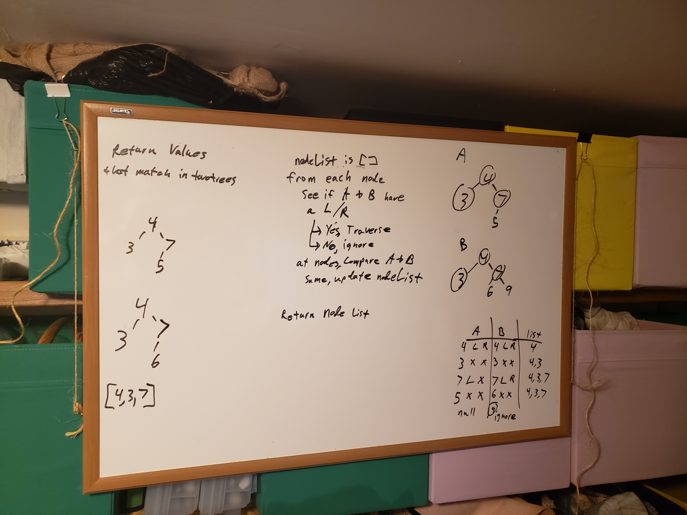

# Tree Intersection

## Challenge

- write a function that will compare two binary trees and show which values match
- complication: there isn't a clear explanation if they have the same shape or not, and that will change the speed/complexity/approach

## Solution 

- write a double-traversal recursive function that looks at the 'same' node in each tree and compares the value.
- if the same value, save that to an array for later comparison
- if at any point the two trees deviate from the same shape, do not compare
- return only the similar values in the similar places in each tree

## Considerations

- this will only compare SIMILAR values of trees
  - dissimilar nodes will not be compared
  - this is by design
  - checking ALL values would require full traversal and different implementations
  - SIZE: O(n) since the original trees are used and no copies are made, except for the values in common, the size is only enlarged by the number of similar values
  - SPEED: O(n) at worst, this will take as long as the two trees are. If the shapes are widely off this will terminate much faster

- comparing ALL values would be at least O(2n) speed as each tree would need to be traversed in entirety and then checks made for values (a hashmap would reduce this time significantly)
- size would be O(3n) as you may need to store off as much as 3 copies, original trees, a full copy of 1 in a hashmap, another array of every match that comes from the hashmap

- Requirements would determine the overal approach

## Whiteboard

